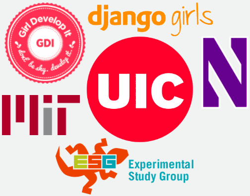
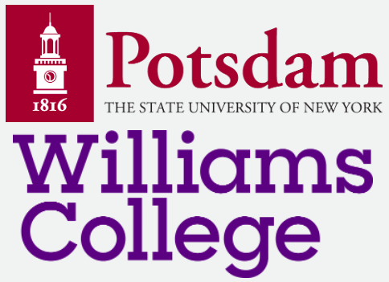

  

    

        
    

    

      

        
<b>Research Scientist</b>  
        Fall 2020 - Current  
        Research Intern, Fall 2019  
        ✔️ Expanding my research vision and building state-of-the-art AI solutions for product.
         

      

    

    

    

    
    

    

    

      
<b>Research Intern</b> 
      Summer 2019 

        ✔️ Learned how to apply ML theory to new applications.
        

    

    

    

    

    
    

    

    

      
<b>3x Software + Data Science Intern</b> 
      Summer 2017 - Spring 2019  

      ✔️ Learned how to build for customers + use ML for strategic decision making.
        

    

    

    

    

    
    

    

    

      
<b>Math + CS Teaching</b> 
      Summer 2010 - Spring 2019  
      ✔️ Learned to elucidate math + CS concepts to technical and non-technical audiences.
        

    

    

    

    

    
    

    

    

      
<b>Other Internships 🇺🇸👩🏽‍🔬</b> 
      Summer 2013 - Summer 2014  
        

    

    

    

    

    
    

    

    

      
<b>Math Research Internships</b> 
      Summer 2011 - Summer 2012  
        

    

    

  

<h3>professional affiliations</h3>

  

    

        
    

    

    <b>A* Member</b>  
    We are a group of Black software engineers helping each other achieve ambitious career goals 💪🏽.
    

